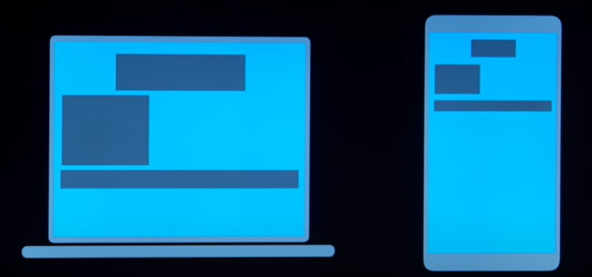
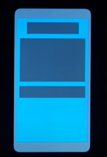

<h2 style="text-align: center">Части Responsive Design</h2>
<ul>
    <li><strong>Viewport</strong></li>
    <li><strong>Media Queries</strong></li>
    <li><strong>Flexbox</strong></li>
    <li><strong>Grids</strong></li>
</ul>
<h3 style="text-align: center">Viewport</h3>
<strong>Viewport</strong> - это видимая область элементов на сайте пользователю несмотря с какого устройства
он зашел. Если не настраивать эту область для разных устройств, то многие важные элементы на разных устройствах
могут сжиматься, уменьшаться или вовсе пропадать как на примере снизу.

Нужный результат.

Что-бы наша веб страница на другом устройстве выглядела чуточку лучше можно добавить
данную строчку в наш html файл.
<pre>
&lt;head&gt;
    &lt;meta name="viewport" content="width=device-width, initial-scale=1.0"
&lt;/head&gt;
</pre>
<h3 style="text-align: center">Media Queries</h3>
<strong>Медиа запросы</strong> - это функция css позволяющия браузеру различных устройств
рендерить контент адаптируясь к различным условиям, например разрешение экрана.
 Так это будет выглядеть в коде.
<pre>
&lt;head&gt;
    &lt;style&gt;
        @media (min-width: 600px) {
            body {
                backround-color: red
            }
        }
    &lt;/style&gt;
&lt;/head&gt;
</pre>

> @media - объявляет о медиа запросе

> (min-width: 600px) - задает условие если разрешение экрана 600 или более пикселей

> body {} - изменяет тело веб сайта

Мы так-же можем добавлять больше медиа запросов и условий для них, изменяя не только цвет сайта,
но и например размер определённого div

